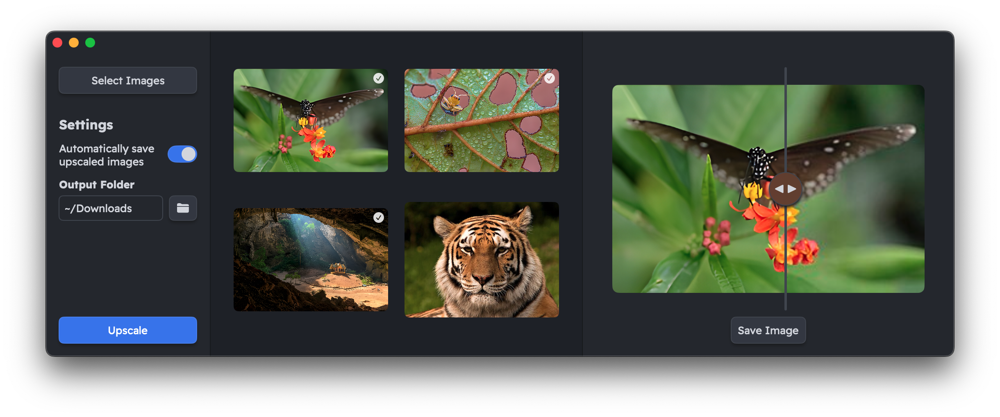

# Superres

Superres is a macOS application for upscaling images using Vision and Core ML to optimize performance on Mac hardware.

## Features

- Upscale images in batch
- Compare original and upscaled images
- Automatically save upscaled images to specified output folder
- Drag and drop images
- Supported image formats: BMP, GIF, JPEG, PNG, TIFF

## Download

Download the latest version from [Releases](https://github.com/joneavila/superres/releases).

## Acknowledgements

- [CoreML-Models](https://github.com/john-rocky/CoreML-Models) – Real-ESRGAN Core ML model
- [Minimal](https://github.com/kepano/obsidian-minimal) – Color scheme
- [Readex Pro](https://fonts.google.com/specimen/Readex+Pro) – Font
- [Polkadot Butterfly](https://commons.wikimedia.org/wiki/File:Polkadot_butterfly_(14136135962).jpg) – Preview Assets image
- [Siberian Tiger](https://commons.wikimedia.org/wiki/File:Siberischer_tiger_de_edit02.jpg) – Preview Assets image
- [Kuha Karuhas Royal Pavilion](https://commons.wikimedia.org/wiki/File:01-พระที่นั่งคูหาคฤหาสน์.jpg) – Preview Assets image
- [Aulacophora Indica](https://commons.wikimedia.org/wiki/File:The_Bug_Peek.jpg) – Preview Assets image

The complete acknowledgements can be found in the application's *Help* > *Acknowledgements* menu.
